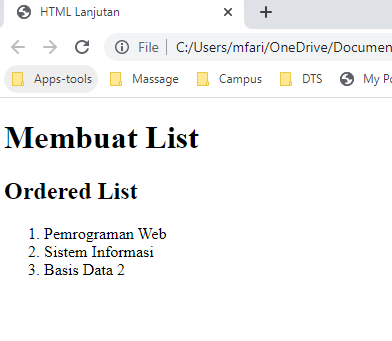
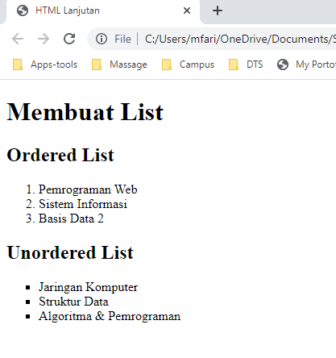
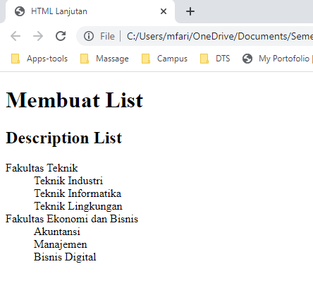
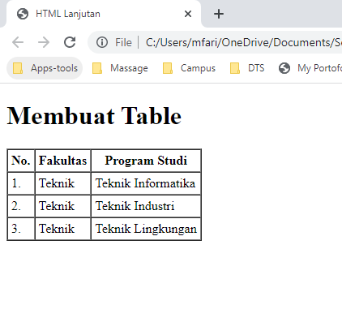
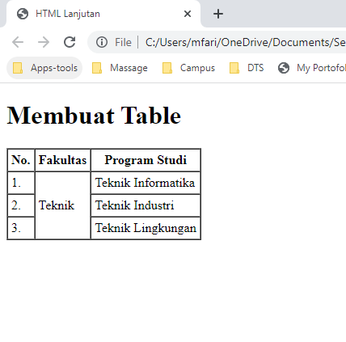
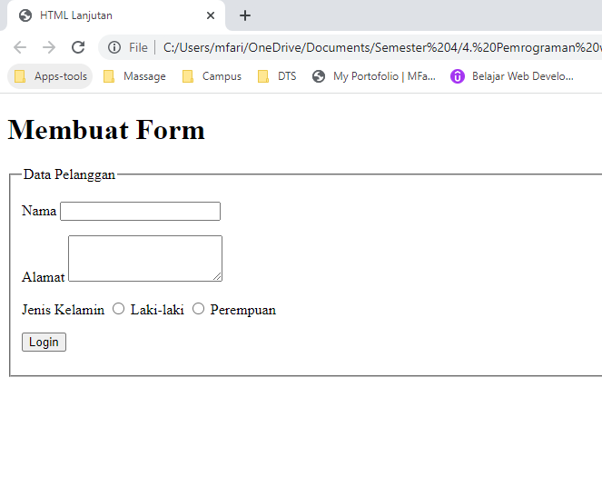
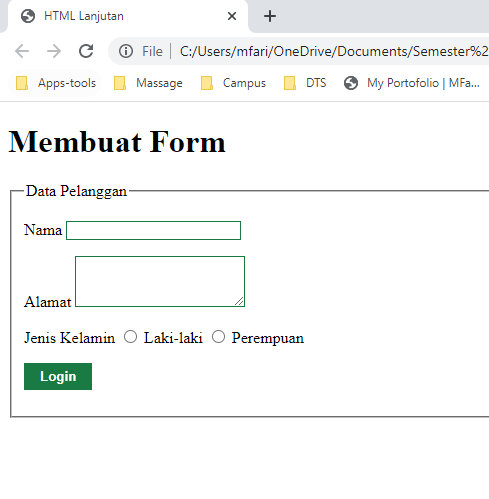
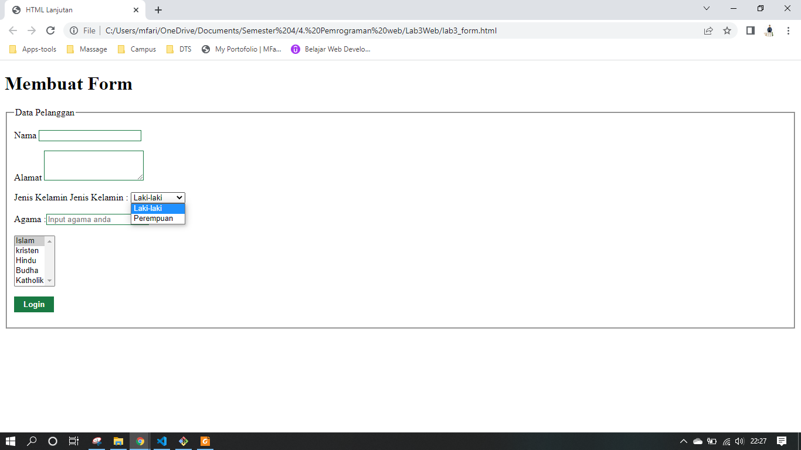

# Lab3Web


**Nama  : Mohamad Farizal Arifin**

**Nim   : 312010231**

**Kelas : TI.20.B.1**

<br>

**Langkah - langkah praktikum**<br>

1. Membuat file html baru dengan nama **lab3_list.html** seperti berikut :<br>

```
<!DOCTYPE html>
<html lang="en">

<head>
    <meta charset="UTF-8">
    <meta name="viewport" content="width=device-width, initial-scale=1.0">
    <title>HTML Lanjutan</title>
</head>

<body>
    <header>
        <h1>Membuat List</h1>
    </header>
</body>
</html>
```
<br>

2. Membuat Ordered List <br>
Tambahkan kode untuk membuat *Orderes list* seperti berikut : <br>

```
    <section id="order-list">
        <h2>Ordered List</h2>
        <ol>
        <li>Pemrograman Web</li>
        <li>Sistem Informasi</li>
        <li>Basis Data 2</li>
        </ol>
    </section>
```
<br>
Simpanlah perubahan tersebut dan lakukan refresh pada web browser untuk melihat hasilnya<br>
<br>

 <br>
<br>

3. Membuat Unordered List <br>
Tambahkan kode berikut untuk membuat *Unorder list* , setelah deklarasi ordered list pada section unordered-list, seperti berikut : <br>

```
    <section id="unorder-list">
        <h2>Unordered List</h2>
        <ul type="square">
        <li>Jaringan Komputer</li>
        <li>Struktur Data</li>
        <li>Algoritma &amp; Pemrograman</li>
        </ul>
    </section>
```
<br>
Simpan kembali perubahannya kemudian refresh halaman web, berikut hasilnya <br>
<br>

 <br>
<br>

4. Membuat Description List <br>
Tambahkan kode untuk membuat description list setelah deklarasi unorderd-list

```
    <section id="unorder-list">
        <h2>Description List</h2>
        <dl>
        <dt>Fakultas Teknik</dt>
        <dd>Teknik Industri</dd>
        <dd>Teknik Informatika</dd>
        <dd>Teknik Lingkungan</dd>
        <dt>Fakultas Ekonomi dan Bisnis</dt>
        <dd>Akuntansi</dd>
        <dd>Manajemen</dd>
        <dd>Bisnis Digital</dd>
        </dl>
    </section>
```
<br>
Berikut hasilnya :<br>
<br>

 <br>
<br>

5. Membuat Table <br>
Buat file baru dengan nama **lab3_tabel.html** seperti berikut <br>

```
<!DOCTYPE html>
<html lang="en">
<head>
    <meta charset="UTF-8">
    <meta name="viewport" content="width=device-width, initial-scale=1.0">
    <title>HTML Lanjutan</title>
</head>
<body>
    <header>
        <h1>Membuat Table</h1>
    </header>
</body>
</html>
```
<br>
Tambahkan kode berikut untuk membuat tabel sederhana <br>

```
    <table border="1" cellpadding="4" cellspacing="0">
        <thead>
            <tr>
                <th>No.</th>
                <th>Fakultas</th>
                <th>Program Studi</th>
            </tr>
        </thead>
        <tbody>
            <tr>
                <td>1.</td>
                <td>Teknik</td>
                <td>Teknik Informatika</td>
            </tr>
            <tr>
                <td>2.</td>
                <td>Teknik</td>
                <td>Teknik Industri</td>
            </tr>
            <tr>
                <td>3.</td>
                <td>Teknik</td>
                <td>Teknik Lingkungan</td>
            </tr>
        </tbody>
    </table>
```
<br>
Berikut hasilnya : <br>
<br>

 <br>
<br>

6. Mengatur Margin dan Padding <br>
Untuk mengatur margin dan padding pada cel data, tambahkan atribut cellpadding dan cellspacing pada tag table <br>

```
<table border="1" cellpadding="4" cellspacing="0">
```
<br>

7. Menggabungkan Sel Data <br>
Untuk menggabungkan sel data, gunakan atribut rowspan dan colspan. Atribut rowspan untuk menggabungkan baris (secara vertikal) dan colspan untuk menggabungkan kolom (secara horizontal)<br>

```
    <table border="1" cellpadding="4" cellspacing="0">
        <thead>
            <tr>
                <th>No.</th>
                <th>Fakultas</th>
                <th>Program Studi</th>
            </tr>
        </thead>
        <tbody>
            <tr>
                <td>1.</td>
                <td rowspan="3">Teknik</td>
                <td>Teknik Informatika</td>
            </tr>
            <tr>
                <td>2.</td>
                <td>Teknik Industri</td>
            </tr>
            <tr>
                <td>3.</td>
                <td>Teknik Lingkungan</td>
            </tr>
        </tbody>
    </table>
```
<br>
Berikut hasilnya : <br>
<br>

 <br>
<br>

8. Membuat Form <br>
Buat file baru dengan nama **lab3_form.html**  <br>

```
<!DOCTYPE html>
<html lang="en">
<head>
    <meta charset="UTF-8">
    <meta name="viewport" content="width=device-width, initial-scale=1.0">
    <title>HTML Lanjutan</title>
</head>

<body>
    <header>
        <h1>Membuat Form</h1>
    </header>
    <form action="proses.php" method="post">
        <fieldset>
            <legend>Data Pelanggan</legend>
            <p>
                <label for="nama">Nama</label>
                <input type="text" id="nama" name="nama">
            </p>
            <p>
                <label for="alamat">Alamat</label>
                <textarea id="alamat" name="alamat" cols="20" rows="3"></textarea>
            </p>
            <p>
                <label>Jenis Kelamin</label>
                <input id="jk_l" type="radio" name="kelamin" value="L" /><label for="jk_l"> Laki-laki </label>
                <input id="jk_p" type="radio" name="kelamin" value="P" /><label for="jk_p"> Perempuan </label>
            </p>
            <p><input type="submit" value="Login"></p>
        </fieldset>
    </form>
    <link rel="stylesheet" href="style.css" type="text/css">
</body>
</html>
```
<br>
Berikut hasilnya : <br>
<br>

 <br>
<br>

9. Menabahkan Style pada Form <br>
Agar tampilan form lebih menarik, bisa ditambahkan CSS seperti berikut, dan menghubungkan file CSS eksternalnya <br>

```
<style>
    form p > label {
        display: inline-block;
        width: 100px;
    }
    form input[type="text"], form textarea {
        border: 1px solid #197a43;
    }
    form input[type="submit"] {
        border: 1px solid #197a43;
        background-color: #197a43;
        color: #ffffff;
        font-weight: bold;
        padding: 5px 15px;
    }
</style>
```
<br>
Berikut hasilnya : <br>
<br>

 <br>
<br>

**Pertanyaan dan Tugas**<br>
1. Buatlah form yang menampilkan *dropdown* menu dan *listbox* dengan multiple selection.<br>

**Jawab**

Berikut ini source code yang telah saya buat untuk memenuhi soal diatas <br>
```
<!DOCTYPE html>
<html lang="en">
<head>
    <meta charset="UTF-8">
    <meta name="viewport" content="width=device-width, initial-scale=1.0">
    <title>HTML Lanjutan</title>
</head>

<body>
    <header>
        <h1>Membuat Form</h1>
    </header>
    <form action="proses.php" method="post">
        <fieldset>
            <legend>Data Pelanggan</legend>
            <p>
                <label for="nama">Nama</label>
                <input type="text" id="nama" name="nama">
            </p>
            <p>
                <label for="alamat">Alamat</label>
                <textarea id="alamat" name="alamat" cols="20" rows="3"></textarea>
            </p>
            <p>
                <label>Jenis Kelamin</label>
                    <label for="jeniskelamin">Jenis Kelamin :</label>
                        <select name="jeniskelamin" id="jeniskelamin">
                            <option value="boy">Laki-laki</option>
                            <option value="girl">Perempuan</option>
                        </select>
                        <br><br>
                
                <label>Agama :<input type="text" Placeholder="Input agama anda"/></label>
                        <br><br>
                        <select name="agama" size="5" multiple="multiple">
                            <option value="islam"> Islam </option>
                            <option value="kristen"> kristen </option>
                            <option value="hindu"> Hindu </option>
                            <option value="budha"> Budha </option>
                            <option value="katholik"> Katholik </option>
                        </select>
                <!--<input id="jk_l" type="radio" name="kelamin" value="L" /><label for="jk_l"> Laki-laki </label>
                <input id="jk_p" type="radio" name="kelamin" value="P" /><label for="jk_p"> Perempuan </label>-->
            </p>
            <p><input type="submit" value="Login"></p>
        </fieldset>
    </form>
    <link rel="stylesheet" href="style.css" type="text/css">
</body>
</html>
```
<br>
Berikut hasilnya : <br>
<br>

 <br>
<br>
<br>

Thank you
